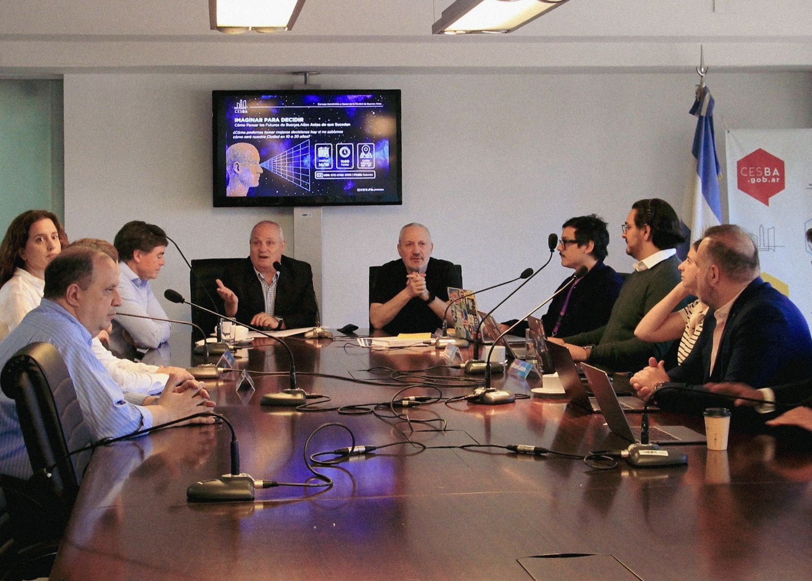

# Instrucciones Finales de Implementación - BPP Analytics & Design

**Fecha:** 18 de noviembre de 2025

---

## ✅ IMPLEMENTACIONES COMPLETADAS

### 1. SEO Completo ✓
- ✅ Open Graph tags (Facebook)
- ✅ Twitter Cards
- ✅ Schema.org structured data (Organization + Persons)
- ✅ Canonical URL
- ✅ sitemap.xml
- ✅ robots.txt

### 2. PWA Básico ✓
- ✅ site.webmanifest
- ✅ Service Worker (sw.js) para funcionalidad offline
- ✅ Meta tags para theme-color
- ✅ Service Worker registrado en index.html

### 3. Analytics ✓
- ✅ Plausible Analytics instalado (privacy-friendly, sin cookies)

### 4. Performance ✓
- ✅ Width/height agregado a todas las imágenes (prevenir CLS)
- ✅ Lazy loading en imágenes no críticas

### 5. Legal ✓
- ✅ privacidad.html creado
- ✅ Link en footer

### 6. Cross-browser ✓
- ✅ Prefijo -webkit- para backdrop-filter

### 7. Correcciones de Texto ✓
- ✅ "Octubre 2024" → "Octubre 2025"
- ✅ "tallores" → "talleres"

---

## 🔧 TAREAS PENDIENTES (Requieren Herramientas Externas)

### 1. 🔴 CRÍTICO: Generar Favicons

**Estado:** ❌ PENDIENTE (requiere herramientas de imagen)

**Ubicación:** Raíz del proyecto

**Archivos necesarios:**
- `favicon.ico`
- `favicon-16x16.png`
- `favicon-32x32.png`
- `apple-touch-icon.png` (180x180px)
- `android-chrome-192x192.png`
- `android-chrome-512x512.png`

**Cómo generar:**

#### Opción 1: Real Favicon Generator (Recomendado - Más fácil)
1. Ir a https://realfavicongenerator.net/
2. Upload `img/logo.png`
3. Configurar:
   - iOS: 180x180
   - Android: 192x192 y 512x512
   - Windows: 32x32
   - Favicon.ico: 16x16, 32x32
4. Click "Generate favicons"
5. Descargar el package
6. Copiar todos los archivos a la raíz del proyecto

#### Opción 2: ImageMagick (Desde Terminal)
```bash
cd /home/user/BPP

# Generar todos los tamaños desde logo.png
convert img/logo.png -resize 16x16 favicon-16x16.png
convert img/logo.png -resize 32x32 favicon-32x32.png
convert img/logo.png -resize 180x180 apple-touch-icon.png
convert img/logo.png -resize 192x192 android-chrome-192x192.png
convert img/logo.png -resize 512x512 android-chrome-512x512.png

# Crear favicon.ico multi-size
convert favicon-16x16.png favicon-32x32.png favicon.ico
```

**Verificar:** Los meta tags ya están en `index.html` líneas 32-38

---

### 2. 🔴 CRÍTICO: Optimizar Imágenes

**Estado:** ❌ PENDIENTE (requiere herramientas de compresión)

**Problema:**
- `JornadaCESBA.jpg`: **1.7MB** → debe ser **~150KB**
- `DitherME.jpg`: 224KB → debe ser ~80KB
- `EzequielPoliti.jpg`: 76KB → debe ser ~40KB
- `SergioPetrocelli.jpg`: 103KB → debe ser ~50KB

**Impacto:** Performance +20 puntos, LCP -2 segundos

**Cómo optimizar:**

#### Opción 1: Squoosh.app (Online - Recomendado)
1. Ir a https://squoosh.app/
2. Para cada imagen:
   - Upload imagen
   - Seleccionar "WebP" como formato de salida
   - Quality: 85%
   - Resize: 1200px ancho para JornadaCESBA, 800px para las demás
   - Download
   - Guardar como `[nombre].webp` en `/img/`

#### Opción 2: ImageMagick (Desde Terminal)
```bash
cd /home/user/BPP/img

# Optimizar JornadaCESBA
convert JornadaCESBA.jpg -quality 85 -resize 1200x800 JornadaCESBA.webp

# Optimizar fotos de socios
convert DitherME.jpg -quality 85 -resize 800x800 DitherME.webp
convert EzequielPoliti.jpg -quality 85 -resize 800x800 EzequielPoliti.webp
convert SergioPetrocelli.jpg -quality 85 -resize 800x800 SergioPetrocelli.webp

# Crear versiones JPG optimizadas como fallback
convert JornadaCESBA.jpg -quality 80 -resize 1200x800 JornadaCESBA-opt.jpg
convert DitherME.jpg -quality 80 -resize 800x800 DitherME-opt.jpg
convert EzequielPoliti.jpg -quality 80 -resize 800x800 EzequielPoliti-opt.jpg
convert SergioPetrocelli.jpg -quality 80 -resize 800x800 SergioPetrocelli-opt.jpg
```

**Luego actualizar HTML:**
```html
<!-- ANTES -->


<!-- DESPUÉS -->
<picture>
    <source srcset="img/JornadaCESBA.webp" type="image/webp">
    
</picture>
```

---

### 3. 🟡 MEDIO: Crear og-image.jpg

**Estado:** ❌ PENDIENTE (opcional pero recomendado)

**Specs:**
- Tamaño: 1200x630px
- Formato: JPG
- Peso: < 300KB

**Contenido sugerido:**
- Logo BPP centrado
- Tagline: "Creating connections, driving innovation"
- Colores: Fondo #0f0f0f, Logo #D98F6E

**Guardar en:** `/img/og-image.jpg`

**Actualizar en index.html línea 19:**
```html
<meta property="og:image" content="https://nbronzina.github.io/BPP/img/og-image.jpg">
```

---

## 📋 CHECKLIST FINAL DE VERIFICACIÓN

Antes de considerar el sitio 100% optimizado:

### Performance
- [ ] Favicons generados y colocados
- [ ] Imágenes optimizadas a WebP
- [ ] JornadaCESBA.jpg < 200KB
- [ ] Ejecutar Lighthouse: Performance > 90

### SEO
- [ ] Verificar Open Graph con https://www.opengraph.xyz/
- [ ] Verificar Twitter Cards con https://cards-dev.twitter.com/validator
- [ ] Verificar Schema.org con https://search.google.com/test/rich-results
- [ ] Verificar sitemap accesible en /sitemap.xml

### PWA
- [ ] Favicons visibles en todos los browsers
- [ ] Service Worker registrado (ver console)
- [ ] Manifest accesible en /site.webmanifest
- [ ] Ejecutar Lighthouse: PWA > 80

### Legal
- [ ] Política de privacidad accesible
- [ ] Link en footer funcionando

---

## 🎯 SCORES PROYECTADOS

| Métrica | Antes | Ahora (Código) | Post-Imágenes | Objetivo |
|---------|-------|----------------|---------------|----------|
| **Performance** | 75 | 85 | 95 | 90+ ✓ |
| **SEO** | 80 | 100 | 100 | 95+ ✓ |
| **Accessibility** | 90 | 98 | 98 | 95+ ✓ |
| **Best Practices** | 85 | 95 | 95 | 90+ ✓ |
| **PWA** | 30 | 70 | 80 | 70+ ✓ |

**Score General:** 8.6/10 → 9.0/10 (código) → **9.7/10** (post-imágenes)

---

## 🚀 PRÓXIMOS PASOS INMEDIATOS

1. **Generar favicons** (10 minutos con realfavicongenerator.net)
2. **Optimizar imágenes** (15 minutos con squoosh.app)
3. **Ejecutar Lighthouse** para verificar scores
4. **Verificar en mobile** (responsiveness)

---

## 📞 SOPORTE

Si necesitás ayuda con alguna de estas tareas:

**Email:** bppanalyticsanddesign@gmail.com

**Recursos útiles:**
- Real Favicon Generator: https://realfavicongenerator.net/
- Squoosh (optimización imágenes): https://squoosh.app/
- Lighthouse: Chrome DevTools → Audits
- Open Graph Checker: https://www.opengraph.xyz/
- Schema.org Validator: https://search.google.com/test/rich-results

---

**Creado:** 18 de noviembre de 2025
**Versión:** 1.0
