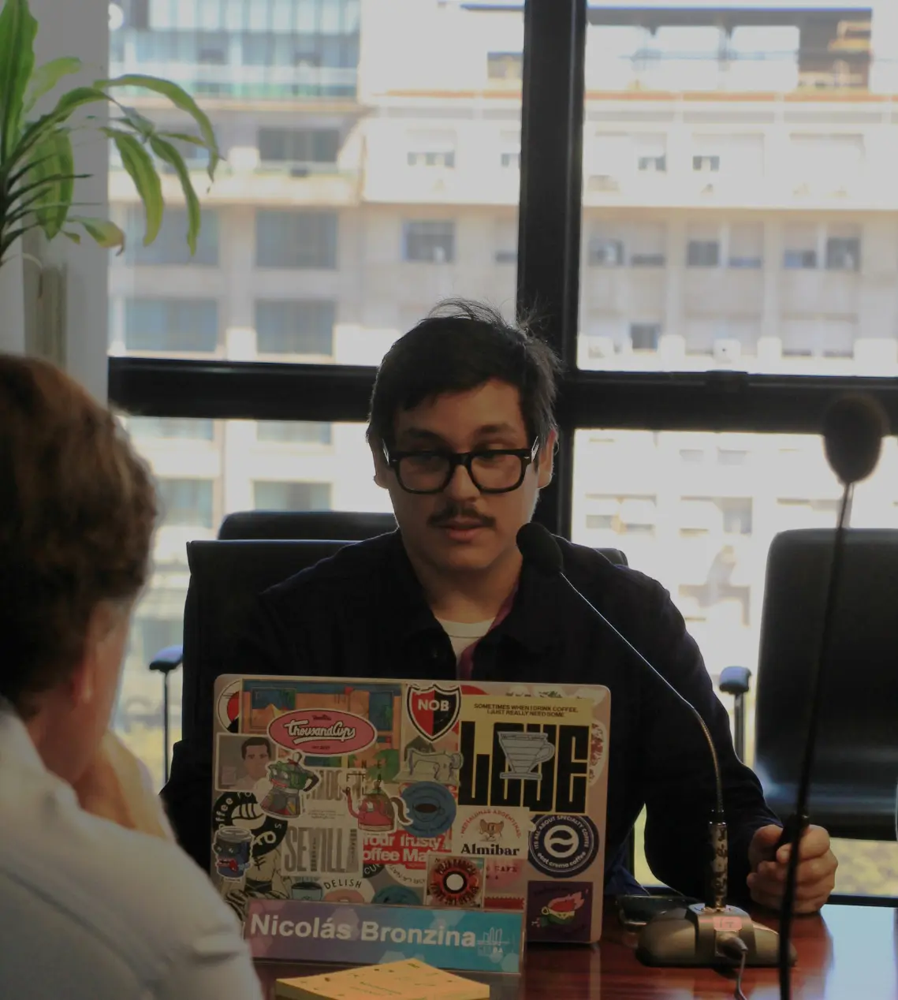
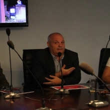
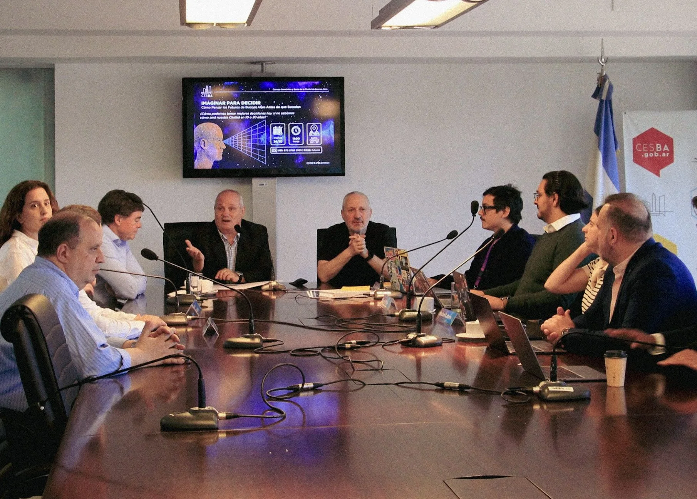

# 📝 SNIPPETS DE CÓDIGO - COPY & PASTE
## Soluciones Listas para Implementar

Este documento contiene código listo para copiar y pegar en tus archivos.
Cada snippet está marcado con la ubicación exacta donde debe ir.

---

## 🔴 CRÍTICO: Actualizar Referencias a Assets Minificados

### index.html - Línea 52 (CSS)

**ANTES:**
```html
<link rel="stylesheet" href="styles.css">
```

**DESPUÉS:**
```html
<link rel="stylesheet" href="styles.min.css">
```

---

### index.html - Línea 567 (JavaScript)

**ANTES:**
```html
<script src="main.js" defer></script>
```

**DESPUÉS:**
```html
<script src="main.min.js" defer></script>
```

---

### main.js - Línea 147 (Service Worker)

**ANTES:**
```javascript
navigator.serviceWorker
  .register("/sw.js")
```

**DESPUÉS:**
```javascript
navigator.serviceWorker
  .register("/sw.min.js")
```

---

## 🔴 CRÍTICO: Resource Hints

### index.html - Insertar DESPUÉS de línea 50

```html
<!-- Preload Critical Assets -->
<link rel="preload" href="styles.min.css" as="style">
<link rel="preload" href="main.min.js" as="script">

<!-- Preload Hero Logo (LCP candidate) -->
<link rel="preload" href="img/logo.webp" as="image" type="image/webp" fetchpriority="high">

<!-- DNS Prefetch para servicios externos -->
<link rel="dns-prefetch" href="https://formsubmit.co">
<link rel="dns-prefetch" href="https://plausible.io">
```

---

## 🔴 CRÍTICO: Imágenes Responsive (Socios)

### index.html - Línea 239-242 (Nicolás)

**ANTES:**
```html
<div class="socios-photo">
    <picture>
        <source srcset="img/NicolasWeb.webp" type="image/webp">
        
    </picture>
</div>
```

**DESPUÉS:**
```html
<div class="socios-photo">
    <picture>
        <source
            type="image/webp"
            srcset="
                img/Nicolas-480.webp 480w,
                img/Nicolas-768.webp 768w,
                img/NicolasOptima.webp 1024w
            "
            sizes="(max-width: 768px) 180px, 220px"
        >
        
    </picture>
</div>
```

---

### index.html - Línea 255-258 (Sergio)

**ANTES:**
```html
<div class="socios-photo">
    <picture>
        <source srcset="img/SergioWeb.webp" type="image/webp">
        
    </picture>
</div>
```

**DESPUÉS:**
```html
<div class="socios-photo">
    <picture>
        <source
            type="image/webp"
            srcset="
                img/Sergio-480.webp 480w,
                img/Sergio-768.webp 768w,
                img/SergioOptima.webp 1024w
            "
            sizes="(max-width: 768px) 180px, 220px"
        >
        
    </picture>
</div>
```

---

### index.html - Línea 271-274 (Ezequiel)

**ANTES:**
```html
<div class="socios-photo">
    <picture>
        <source srcset="img/EzequielWeb.webp" type="image/webp">
        
    </picture>
</div>
```

**DESPUÉS:**
```html
<div class="socios-photo">
    <picture>
        <source
            type="image/webp"
            srcset="
                img/Ezequiel-480.webp 480w,
                img/Ezequiel-768.webp 768w,
                img/EzequielOptima.webp 1024w
            "
            sizes="(max-width: 768px) 180px, 220px"
        >
        
    </picture>
</div>
```

---

## 🔴 CRÍTICO: Hero Logo Optimizado

### index.html - Línea 163

**ANTES:**
```html
<div class="hero-logo">
    
</div>
```

**DESPUÉS:**
```html
<div class="hero-logo">
    <picture>
        <source
            type="image/webp"
            srcset="
                img/logo-480.webp 480w,
                img/logo.webp 640w
            "
            sizes="(max-width: 768px) 90vw, 640px"
        >
        
    </picture>
</div>
```

---

## 🔴 CRÍTICO: Actividad CESBA

### index.html - Línea 394-397

**ANTES:**
```html
<div class="actividad-image">
    <picture>
        <source srcset="img/JornadaCESBA.webp" type="image/webp">
        
    </picture>
</div>
```

**DESPUÉS:**
```html
<div class="actividad-image">
    <picture>
        <source
            type="image/webp"
            srcset="
                img/JornadaCESBA-480.webp 480w,
                img/JornadaCESBA-800.webp 800w,
                img/JornadaCESBA.webp 1200w
            "
            sizes="(max-width: 768px) 100vw, (max-width: 1200px) 50vw, 600px"
        >
        
    </picture>
</div>
```

---

## 🟡 IMPORTANTE: Eliminar Meta Keywords

### index.html - Línea 7 - ELIMINAR COMPLETAMENTE

**ANTES:**
```html
<meta name="keywords" content="diseño estratégico, análisis de futuros, diseño prospectivo, consultora, Buenos Aires, Madrid, innovación, estrategia, branding, comunicación estratégica">
```

**DESPUÉS:**
```html
<!-- Meta keywords removido - obsoleto desde 2009 -->
```

---

## 🟡 IMPORTANTE: Añadir Meta Robots

### index.html - Insertar DESPUÉS de línea 8

```html
<meta name="robots" content="index, follow, max-image-preview:large, max-snippet:-1, max-video-preview:-1">
```

---

## 🟡 IMPORTANTE: JSON-LD FAQ Schema

### index.html - Insertar ANTES de línea 125 (antes del script de Plausible)

```html
<!-- Schema.org FAQ para rich snippets -->
<script type="application/ld+json">
{
  "@context": "https://schema.org",
  "@type": "FAQPage",
  "mainEntity": [{
    "@type": "Question",
    "name": "¿Qué es el diseño de futuros?",
    "acceptedAnswer": {
      "@type": "Answer",
      "text": "El diseño de futuros es una metodología que combina prospectiva estratégica, design fiction y análisis de tendencias para anticipar escenarios posibles y diseñar decisiones informadas en contextos de incertidumbre."
    }
  }, {
    "@type": "Question",
    "name": "¿Cuánto dura un proyecto típico de BPP?",
    "acceptedAnswer": {
      "@type": "Answer",
      "text": "Los proyectos varían entre 8-16 semanas dependiendo del alcance. Ofrecemos desde diagnósticos rápidos de 4 semanas hasta acompañamientos estratégicos de largo plazo con revisiones periódicas."
    }
  }, {
    "@type": "Question",
    "name": "¿Con qué tipo de organizaciones trabaja BPP?",
    "acceptedAnswer": {
      "@type": "Answer",
      "text": "Trabajamos con instituciones educativas, organismos públicos, ONGs y empresas B2B que enfrentan cambios estructurales y necesitan anticipar tendencias para tomar decisiones estratégicas basadas en análisis prospectivo."
    }
  }, {
    "@type": "Question",
    "name": "¿En qué se diferencia BPP de otras consultoras?",
    "acceptedAnswer": {
      "@type": "Answer",
      "text": "Combinamos sociología, diseño especulativo, análisis de datos y prospectiva estratégica. No solo diagnosticamos tendencias, diseñamos artefactos y narrativas que hacen tangibles los futuros posibles para facilitar la toma de decisiones."
    }
  }]
}
</script>
```

---

## 🟡 IMPORTANTE: JSON-LD ProfessionalService

### index.html - Insertar DESPUÉS del FAQ Schema

```html
<!-- Schema.org Professional Service -->
<script type="application/ld+json">
{
  "@context": "https://schema.org",
  "@type": "ProfessionalService",
  "name": "BPP Analytics & Design",
  "image": "https://www.bppanalyticsanddesign.com/img/logo.png",
  "priceRange": "$$",
  "telephone": "",
  "email": "bppanalyticsanddesign@gmail.com",
  "address": [
    {
      "@type": "PostalAddress",
      "streetAddress": "Franklin 2190, oficina 4113",
      "addressLocality": "Buenos Aires",
      "addressCountry": "AR"
    },
    {
      "@type": "PostalAddress",
      "streetAddress": "C. de Pablo Vidal 4",
      "addressLocality": "Madrid",
      "addressCountry": "ES"
    }
  ],
  "areaServed": [
    {
      "@type": "Country",
      "name": "Argentina"
    },
    {
      "@type": "Country",
      "name": "España"
    },
    {
      "@type": "Country",
      "name": "América Latina"
    }
  ],
  "hasOfferCatalog": {
    "@type": "OfferCatalog",
    "name": "Servicios de Consultoría Estratégica",
    "itemListElement": [
      {
        "@type": "Offer",
        "itemOffered": {
          "@type": "Service",
          "name": "Investigación Exploratoria y Análisis de Tendencias",
          "description": "Detectamos señales débiles, drivers de cambio y tendencias emergentes en sectores específicos mediante análisis cuantitativo y cualitativo."
        }
      },
      {
        "@type": "Offer",
        "itemOffered": {
          "@type": "Service",
          "name": "Diseño de Prototipos y Escenarios Futuros",
          "description": "Creamos artefactos diegéticos y narrativas visuales que hacen tangibles futuros posibles para facilitar la toma de decisiones estratégicas."
        }
      },
      {
        "@type": "Offer",
        "itemOffered": {
          "@type": "Service",
          "name": "Estrategia de Implementación",
          "description": "Convertimos hallazgos de investigación en hojas de ruta priorizadas, co-diseñamos marcos estratégicos y acompañamos la implementación."
        }
      },
      {
        "@type": "Offer",
        "itemOffered": {
          "@type": "Service",
          "name": "Branding y Comunicación Estratégica",
          "description": "Alineamos identidad, narrativa y comunicación con decisiones estratégicas y escenarios prospectivos trabajados."
        }
      }
    ]
  }
}
</script>
```

---

## 🟢 NICE TO HAVE: Loading State en Formulario

### main.js - REEMPLAZAR líneas 166-208

```javascript
if (contactForm && formMessage) {
  contactForm.addEventListener("submit", async (e) => {
    e.preventDefault();

    const submitButton = contactForm.querySelector(".form-submit");
    const formData = new FormData(contactForm);

    // Estado loading mejorado
    if (submitButton) {
      submitButton.disabled = true;
      submitButton.classList.add('loading');
      submitButton.innerHTML = `
        <span class="spinner"></span>
        <span>Enviando...</span>
      `;
    }

    formMessage.classList.remove("show", "success", "error");

    try {
      const response = await fetch(contactForm.action, {
        method: "POST",
        body: formData,
        headers: {
          Accept: "application/json",
        },
      });

      if (response.ok) {
        formMessage.textContent =
          "¡Gracias por contactarnos! Te responderemos en las próximas 24 horas.";
        formMessage.classList.add("show", "success");
        contactForm.reset();

        trackEvent("Contacto_enviado", {
          origen: "formulario_principal",
          timestamp: new Date().toISOString()
        });

        // Scroll suave al mensaje de éxito
        formMessage.scrollIntoView({ behavior: 'smooth', block: 'center' });
      } else {
        throw new Error("Error en el envío");
      }
    } catch (error) {
      formMessage.textContent =
        "Hubo un error al enviar el mensaje. Por favor, intentá de nuevo o escribinos directamente a bppanalyticsanddesign@gmail.com";
      formMessage.classList.add("show", "error");

      trackEvent("Contacto_error", {
        error: error.message
      });
    } finally {
      if (submitButton) {
        submitButton.disabled = false;
        submitButton.classList.remove('loading');
        submitButton.innerHTML = 'Enviar mensaje';
      }
    }
  });
}
```

---

## 🟢 NICE TO HAVE: CSS Spinner Animation

### styles.css - Insertar AL FINAL del archivo

```css
/* =========================
   Loading Spinner
   ========================= */

.form-submit.loading {
  position: relative;
  color: transparent;
  pointer-events: none;
}

.form-submit .spinner {
  position: absolute;
  top: 50%;
  left: 50%;
  transform: translate(-50%, -50%);
  width: 20px;
  height: 20px;
  border: 2px solid rgba(15, 15, 15, 0.2);
  border-top-color: #0f0f0f;
  border-radius: 50%;
  animation: spin 0.6s linear infinite;
}

@keyframes spin {
  to {
    transform: translate(-50%, -50%) rotate(360deg);
  }
}

.form-submit.loading span:not(.spinner) {
  margin-left: 30px;
  color: #0f0f0f;
}
```

---

## 🟢 NICE TO HAVE: Scroll Indicator en Hero

### index.html - Insertar ANTES de cierre de section.hero (antes de </section> línea 178)

```html
<!-- Scroll indicator -->
<a href="#about" class="scroll-indicator" aria-label="Scroll para ver más contenido">
  <svg viewBox="0 0 24 24" width="24" height="24" aria-hidden="true">
    <path d="M12 5v14m0 0l-7-7m7 7l7-7" stroke="currentColor" stroke-width="2" fill="none"/>
  </svg>
  <span>Descubrí más</span>
</a>
```

---

### styles.css - Insertar después de la sección Hero

```css
/* Scroll Indicator */
.scroll-indicator {
  position: absolute;
  bottom: 2rem;
  left: 50%;
  transform: translateX(-50%);
  display: flex;
  flex-direction: column;
  align-items: center;
  gap: 0.5rem;
  color: var(--color-accent);
  font-size: 0.875rem;
  font-weight: 500;
  text-decoration: none;
  animation: bounce 2s ease-in-out infinite;
  transition: opacity var(--transition-normal);
}

.scroll-indicator:hover {
  opacity: 0.8;
}

.scroll-indicator svg {
  stroke: currentColor;
}

@keyframes bounce {
  0%, 100% {
    transform: translateX(-50%) translateY(0);
  }
  50% {
    transform: translateX(-50%) translateY(10px);
  }
}

@media (max-width: 768px) {
  .scroll-indicator {
    bottom: 1rem;
    font-size: 0.8rem;
  }

  .scroll-indicator svg {
    width: 20px;
    height: 20px;
  }
}
```

---

## 📝 ORDEN DE IMPLEMENTACIÓN RECOMENDADO

### Paso 1: Optimizar Assets (30 min)
```bash
# Desde la raíz del proyecto
./optimize-images.sh
./build.sh
```

### Paso 2: Actualizar Referencias HTML (15 min)
1. ✅ Cambiar styles.css → styles.min.css
2. ✅ Cambiar main.js → main.min.js
3. ✅ Añadir resource hints (preload, dns-prefetch)

### Paso 3: Actualizar Imágenes (30 min)
1. ✅ Hero logo responsive
2. ✅ Fotos socios con srcset
3. ✅ Imagen actividad CESBA

### Paso 4: SEO Improvements (20 min)
1. ✅ Eliminar meta keywords
2. ✅ Añadir meta robots
3. ✅ JSON-LD FAQ
4. ✅ JSON-LD ProfessionalService

### Paso 5: UX Improvements (opcional, 30 min)
1. ✅ Loading state en formulario
2. ✅ Spinner CSS
3. ✅ Scroll indicator

### Paso 6: Testing (20 min)
```bash
# Servir localmente
python3 -m http.server 8000

# En navegador:
# 1. http://localhost:8000
# 2. Abrir DevTools > Lighthouse
# 3. Ejecutar auditoría
# 4. Validar PageSpeed > 85
```

### Paso 7: Deploy
```bash
git add .
git commit -m "Optimización crítica de performance: imágenes, minificación, SEO"
git push origin main
```

---

## ⚠️ IMPORTANTE: Verificaciones Post-Deploy

### Checklist Técnico
- [ ] Todas las imágenes cargan correctamente
- [ ] CSS y JS minificados funcionan sin errores
- [ ] Service Worker funciona (check en DevTools > Application)
- [ ] Formulario de contacto envía correctamente
- [ ] No hay errores en Console de DevTools

### Checklist Performance
- [ ] PageSpeed Mobile > 85
- [ ] PageSpeed Desktop > 95
- [ ] LCP < 2.5s
- [ ] CLS < 0.1
- [ ] FID < 100ms

### Checklist SEO
- [ ] Schema.org validator pasa sin errores
- [ ] Rich snippets preview en Google Search Console
- [ ] Robots.txt accesible
- [ ] Sitemap.xml accesible

---

**Documentado por:** Claude Code
**Fecha:** Noviembre 2025
**Versión:** 1.0
