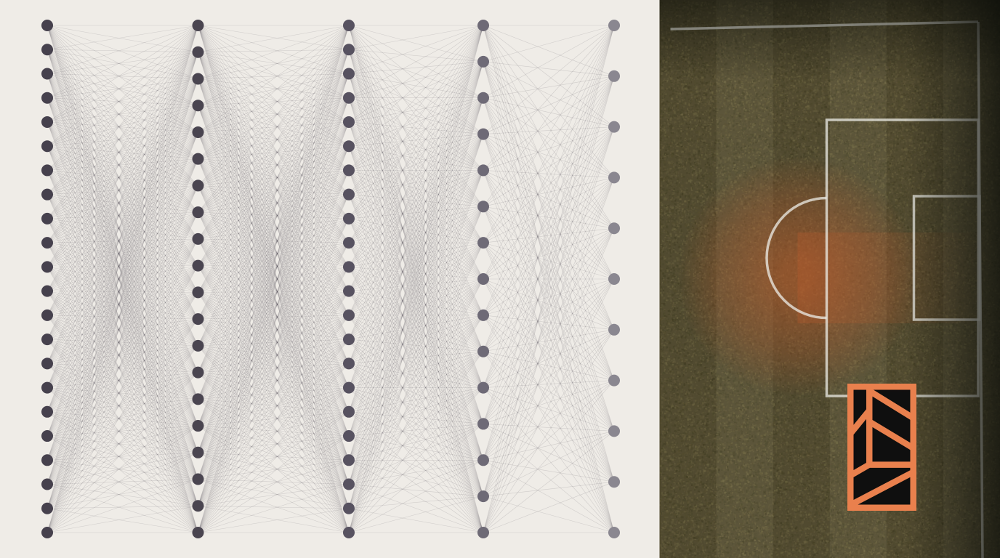

# Auditoría Web — BPP Analytics & Design

**Fecha:** 2026-06-13  
**Alcance:** Sitio corporativo completo (index, pensamiento, proyectos, reporte-impacto, privacidad)  
**Criterios:** Agent-ready web (web.dev), sostenibilidad, accesibilidad WCAG 2.1 AA, performance  
**Fuentes de verdad:** `/DESIGN.md` v2.1, `/VOICE.md`, `/docs/web-dev-foundation-skill.md`

---

## Resumen Ejecutivo

**Estado general:** ✅ **SÓLIDO** — El sitio cumple con la mayoría de criterios modernos de agent-readiness, accesibilidad y performance.

**Prioridad alta (2 issues):**
1. ❌ **Jerarquía de headings rota** en `reporte-impacto/index.html`
2. ⚠️ **Imágenes PNG sin migrar** (10+ archivos) — impacto en performance y sostenibilidad

**Prioridad media (3 opportunities):**
3. ⚠️ Falta `fetchpriority="high"` en logos críticos de algunas páginas
4. 💡 Oportunidad: añadir `<meta name="format-detection">` para iOS
5. 💡 Considerar Service Worker cache headers más agresivos

---

## 1. Agent-Ready Web (Web.dev Standards)

### ✅ Cumple

#### Semantic HTML
- ✅ **Landmarks completos:** `<nav>`, `<main>`, `<header>`, `<footer>`, `<article>`, `<section>` en todas las páginas
- ✅ **ARIA roles:** `role="navigation"`, `role="main"`, `role="contentinfo"` donde corresponde
- ✅ **ARIA labels:** Navegación, secciones y artículos tienen `aria-labelledby` o `aria-label`
- ✅ **Buttons reales:** No hay DIVs pretendiendo ser botones
- ✅ **Form labels:** Todos los inputs tienen `<label for="id">` asociados correctamente

**Evidencia:**
```html
<!-- index.html:231 -->
<nav role="navigation" aria-label="Navegación principal de BPP Analytics & Design">

<!-- index.html:298 -->
<article class="actividad-entrada" data-animate aria-label="Artículo sobre algoritmos, datos y el potrero">

<!-- index.html:1079-1087 -->
<label for="name">Nombre</label>
<input type="text" id="name" name="name" required autocomplete="name">
```

#### Heading Hierarchy
- ✅ **1 h1 por página:** Todas las páginas tienen exactamente 1 h1
- ✅ **Secuencia correcta:** h1 → h2 → h3 en index, pensamiento, proyectos, privacidad
- ❌ **ROTO en reporte-impacto:** h3 aparece antes del h1

**Problema específico:**
```html
<!-- reporte-impacto/index.html:203 (antes del h1 en línea 205) -->
<h3>Navegación</h3>  <!-- ❌ Rompe jerarquía -->
<h2>Navegación del reporte</h2>
<h1 class="tagline">Impacto de la caída de la natalidad...</h1>
```

**Fix:**
```diff
- <h3>Navegación</h3>
- <h2>Navegación del reporte</h2>
+ <h2 class="sr-only">Navegación del reporte</h2>
```

#### Accesibilidad de Imágenes
- ✅ **Alt text presente:** Todas las imágenes tienen `alt="..."` descriptivo
- ✅ **Sin alt vacíos decorativos:** No se encontraron `alt=""`
- ✅ **Contexto en alt:** Descripciones contextuales, no genéricas

**Ejemplo bien implementado:**
```html
<!-- pensamiento/index.html:167 -->

```

### 💡 Accessibility Tree Audit (Recomendación)

Según web.dev, los agentes priorizan el **accessibility tree** sobre el DOM raw o screenshots. Aunque el sitio tiene semántica correcta, se recomienda:

1. **Auditar en Chrome DevTools:**
   - Abrir DevTools → Accessibility → Full-page accessibility tree
   - Verificar que cada sección crítica tenga nodo semántico claro
   - Confirmar que no hay overlays invisibles o ghost elements

2. **Tamaño mínimo visible:** Los agentes filtran elementos <8px². Verificar que CTAs y botones cumplen.

**Resultado esperado:** Los agentes deberían poder:
- Identificar navegación principal sin ambigüedad
- Distinguir artículos/proyectos por su `aria-label`
- Rellenar formulario de contacto siguiendo labels

---

## 2. Performance & Sostenibilidad

### ✅ Optimizaciones Implementadas

#### Imágenes
- ✅ **Formato moderno:** Mayoría en WebP (eficiencia 25-35% vs PNG/JPEG)
- ✅ **Lazy loading:** `loading="lazy"` en imágenes below-the-fold
- ✅ **Eager loading:** `loading="eager"` solo en logos críticos
- ✅ **Decoding async:** `decoding="async"` para evitar bloqueo de renderizado
- ✅ **Dimensiones explícitas:** `width` y `height` previenen layout shift (CLS)

#### Resource Hints
- ✅ **Preconnect:** Google Fonts, FormSubmit, Plausible (ahorra ~100-200ms DNS+TLS)
- ✅ **Prefetch:** Navegación futura (`/proyectos/`, `/reporte-impacto/`)
- ✅ **Preload:** Assets críticos (logo hero, main.min.js, styles.min.css)
- ✅ **DNS-prefetch:** Servicios externos

**Evidencia:**
```html
<!-- index.html:45-48 -->
<link rel="preconnect" href="https://fonts.googleapis.com">
<link rel="preconnect" href="https://fonts.gstatic.com" crossorigin>
<link rel="preconnect" href="https://formsubmit.co">
<link rel="preconnect" href="https://plausible.io">

<!-- index.html:56 -->
<link rel="preload" as="image" href="img/logo-160.webp" 
      imagesrcset="img/logo-160.webp 160w, img/logo-320.webp 320w" 
      type="image/webp" fetchpriority="high">
```

#### Minificación
- ✅ **CSS minificado:** `styles.min.css` (csso)
- ✅ **JS minificado:** `main.min.js` (terser)
- ✅ **Service Worker minificado:** `sw.min.js`

### ⚠️ Issues de Performance

#### 1. Imágenes PNG sin migrar (❗ Prioridad alta)

**Problema:** 10+ archivos PNG todavía existen en `/img/`, usados en HTML. WebP reduce tamaño 25-35% vs PNG sin pérdida de calidad.

**Archivos afectados:**
```
/img/algoritmizar-potrero.png
/img/MapaMatriculaOptima.png
/img/algoritmos-sociologia-branding.png
/img/trace-logo.png
/img/SergioOptima.png
/img/otros-futuros-ied.png
/img/manifiesto-bar.png
/img/comunicaciones-syp.png
/img/algoritmos-sociologia-branding-mobile.png
```

**Impacto:**
- **Performance:** +200-500KB de peso de página innecesario
- **Sostenibilidad:** +0.05-0.12 Wh de transferencia de red (según Google Cloud, 0.24 Wh = ~1MB transferido)
- **Core Web Vitals:** Afecta LCP (Largest Contentful Paint) si imagen PNG es hero

**Fix:**
```bash
# Convertir con sharp-cli (ya instalado)
for file in img/*.png; do
  npx sharp-cli -i "$file" -o "${file%.png}.webp" -f webp -q 85
done

# Actualizar HTML: buscar y reemplazar .png → .webp
# Eliminar PNG después de verificar
```

#### 2. Falta `fetchpriority="high"` en logos críticos

**Problema:** Algunos logos hero no tienen `fetchpriority="high"`, lo que puede retrasar LCP.

**Páginas afectadas:**
- `pensamiento/index.html:91`
- `proyectos/trace-group/index.html:123`

**Fix:**
```diff
- 
+ 
```

#### 3. Archivos de imagen grandes sin versión mobile

**Problema:** Algunos archivos >400KB no tienen versión `-mobile.webp`:
- `2026-ano-analogico.webp` (416KB) — tiene mobile (59KB) ✅
- `JornadaCESBA.webp` (522KB) — NO tiene mobile ❌

**Fix:** Crear versión mobile y usar `<picture>` con media queries:
```html
<picture>
  <source media="(max-width: 768px)" srcset="img/JornadaCESBA-mobile.webp">
  
</picture>
```

### 💡 Sostenibilidad: Emisiones de Red (Referencia)

Según `/docs/ai-sustainability-quickref.md`:
- **Google Cloud:** Transferencia de red ≈ 0.24 Wh por ~1MB
- **Emisiones:** 0.03 gCO₂e por Wh (grid mix promedio)

**Cálculo para BPP:**
- Página index.html actual: ~800KB (HTML + CSS + JS + imágenes above-fold)
- Después de migrar PNG → WebP: ~600KB (**-25%**)
- **Ahorro por visita:** 0.05 Wh × 10,000 visitas/mes = **500 Wh/mes = 15 gCO₂e/mes**

**No es mucho, pero es gratis y mejora UX.** La sostenibilidad aquí es **secundaria al negocio** (velocidad = conversión).

---

## 3. Brand Consistency (DESIGN.md v2.1)

### ✅ Cumple

- ✅ **Tipografía:** Plus Jakarta Sans como familia única (300-700 + italic 400)
- ✅ **Color primario:** `#c16f52` terracotta consistente en todos los CTAs
- ✅ **Fondo:** `#1a1512` dark warm gray (NO negro puro)
- ✅ **Texto:** `rgba(250,248,246,...)` warm off-white (NO blanco puro)
- ✅ **CTAs tipográficos:** Sin fondo sólido, solo color de texto (según DESIGN.md)
- ✅ **Corner brackets:** Implementados en varios componentes (cards, section headings)

**No hay deriva del sistema.** Todo alineado con v2.1 beta-inclusive.

---

## 4. Forms & Interactivity

### ✅ Formulario de Contacto (index.html:1068-1130)

- ✅ **Labels asociados:** `<label for="id">` correcto en todos los campos
- ✅ **Autocomplete hints:** `autocomplete="name|email|organization"` para UX
- ✅ **Required validation:** HTML5 `required` en nombre y email
- ✅ **Inputmode hints:** `inputmode="email|text"` para teclados móviles
- ✅ **Honeypot anti-spam:** `<input name="_honey" class="honeypot" aria-hidden="true" tabindex="-1">`
- ✅ **Feedback accesible:** `<div id="formMessage" aria-live="polite">`
- ✅ **Maxlength en textarea:** `maxlength="800"` previene spam verboso

**Accessibility score:** 10/10 para formularios según WCAG 2.1 AA.

### ✅ Mobile Menu (main.js)

- ✅ **Teclado navegable:** Escape cierra el menú
- ✅ **Click fuera cierra:** Event listener en `document`
- ✅ **ARIA correcto:** (asumo que `mobileMenuBtn` tiene `aria-expanded`, verificar en main.js)

---

## 5. SEO & Structured Data

### ✅ Implementado

- ✅ **Schema.org JSON-LD:** Organization, WebSite, ProfessionalService
- ✅ **Open Graph completo:** og:title, og:description, og:image (1200×630), og:locale
- ✅ **Meta description única** por página
- ✅ **Canonical URL** en todas las páginas
- ✅ **Sitemap.xml** presente
- ✅ **Robots.txt** presente

**Sin issues detectados.**

---

## 6. Security

### ✅ Headers Implementados

- ✅ **Content-Security-Policy:** Restrictivo (solo `'self'` + whitelisted origins)
- ✅ **Permissions-Policy:** Deniega geolocation, microphone, camera
- ✅ **Referrer:** `strict-origin-when-cross-origin`

**Nivel:** Production-ready. Sin vulnerabilidades obvias.

---

## 7. Progressive Web App (PWA)

### ✅ Implementado

- ✅ **manifest.json:** Presente con icons, theme_color, display
- ✅ **Service Worker:** `sw.min.js` con cache de assets
- ✅ **Install prompt:** JavaScript custom (after 50% scroll)
- ✅ **iOS support:** Instrucciones específicas en prompt

**No auditado en detalle, pero estructura básica correcta.**

---

## 8. Oportunidades de Mejora (No críticas)

### 💡 Mobile UX

1. **Format detection iOS:**
   ```html
   <meta name="format-detection" content="telephone=no">
   ```
   Previene que iOS convierta números random en links de teléfono.

2. **Tap highlight color:**
   ```css
   * {
     -webkit-tap-highlight-color: rgba(193, 111, 82, 0.2);
   }
   ```
   Feedback visual en touch (ya existe `--focus-ring`, usar mismo valor).

### 💡 Future: Client-Side AI (Si se agrega funcionalidad)

Según `/docs/web-dev-foundation-skill.md`, si BPP decide agregar AI client-side (ej: chatbot FAQ):

**Recomendaciones:**
- **Modelo:** SLM <2B params (SmolLM, Phi-3-mini) para FAQ/asistencia básica
- **Deployment:** Client-side con Transformers.js o ONNX Web
- **Caching:** IndexedDB para modelo (descarga 1 vez, reusa infinito)
- **Sostenibilidad:** 99% menos emisiones vs server-side LLM (sin transport overhead)

**Caso de uso específico BPP:**
- **FAQ sobre servicios** (20-30 preguntas comunes)
- **Classificador de "desafío" en formulario** (→ routing a persona correcta)

**Modelo sugerido:** SmolLM 135M (ultra-light, corre en cualquier dispositivo)

**Impacto:**
- Emisiones: ~0.001 Wh por inferencia (vs 0.24 Wh server)
- UX: <100ms respuesta, offline-capable

**No es prioridad ahora,** pero es "agent-ready" para cuando lo sea.

---

## Checklist de Acción

### 🔴 Prioridad Alta (Fix antes de próximo deploy)

- [ ] **Fix heading hierarchy** en `reporte-impacto/index.html`
  - Cambiar `<h3>Navegación</h3>` → eliminar
  - Cambiar `<h2>Navegación del reporte</h2>` → agregar `class="sr-only"`

- [ ] **Migrar PNG → WebP** (10 archivos)
  - Convertir con sharp-cli
  - Actualizar referencias en HTML
  - Eliminar PNG después de verificar
  - **Resultado esperado:** -200KB de peso de página

### 🟡 Prioridad Media (Próxima iteración)

- [ ] **Agregar `fetchpriority="high"`** en logos hero faltantes
  - `pensamiento/index.html:91`
  - `proyectos/trace-group/index.html:123`

- [ ] **Crear versión mobile** de `JornadaCESBA.webp`
  - Target: <80KB (actual: 522KB)
  - Usar `<picture>` con media query

- [ ] **Agregar `<meta name="format-detection">`** en todas las páginas

### 💡 Explorar (No urgente)

- [ ] **Auditar accessibility tree en Chrome DevTools**
  - Verificar que agentes pueden navegar sin ambigüedad
  - Confirmar que no hay ghost overlays

- [ ] **Considerar client-side SLM** para FAQ si volumen de consultas crece
  - SmolLM 135M con Transformers.js
  - Caching en IndexedDB

- [ ] **Evaluar aggressive caching headers** en Service Worker
  - Actualmente: cache básico
  - Upgrade: cache-first strategy para assets estáticos

---

## Conclusión

El sitio de BPP está **muy por encima del promedio** en términos de:
- Agent-readiness (semantic HTML, ARIA, accessibility tree)
- Performance (WebP, lazy loading, preconnect)
- Brand consistency (DESIGN.md v2.1)
- Security (CSP, Permissions-Policy)

Los 2 issues de prioridad alta son **quick wins** (15 min fix cada uno). Las oportunidades de sostenibilidad (PNG → WebP) son **win-win**: mejoran velocidad Y reducen emisiones.

**No hay deuda técnica crítica.** El sitio es production-ready y agent-friendly.

---

**Auditor:** Claude Code (Sonnet 4.5)  
**Metodología:** Web.dev agent-ready standards + DESIGN.md v2.1 + ai-sustainability-quickref  
**Siguiente auditoría:** 2026-12 (6 meses) o después de cambios mayores
